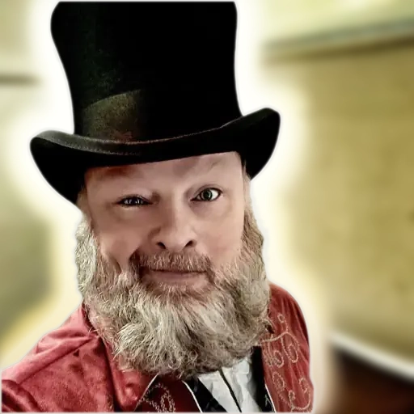
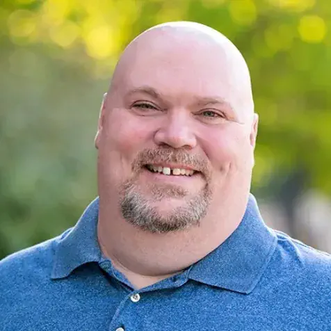
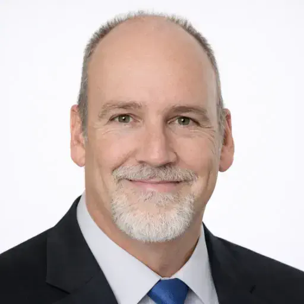
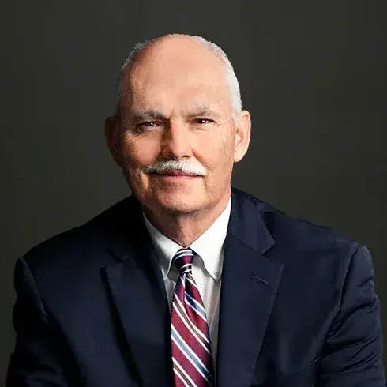

# ✨ AI & LLM: Existential Threat, or Shiny New Tool?

## Jim McKeeth, Kevin Rank, Richard Hundhausen, Bradlee Frazer, Mark Michaelis, Benjamin Michaelis

### Boise Code Camp 2026 - May 2nd, 2026

A roundtable panel discussion on the state of software development, the trajectory of AI, and the evolving nature of employment.

The fear of automation predates our teaching sand to think. This is not the first seismic shift in the software development landscape, but many are asking if it will be the last. Move past the hype and let's focus on the human element of our industry.

Bring your questions and join the conversation to discusses:

* The practical impact of AI tools on daily coding workflows.
* Shifting job roles, expectations, and long-term career stability.
* How developers can adapt, pivot, and leverage these new technologies.
* The changes in education and learning today and for future students.

---

## Speaker: Jim McKeeth

I caught the programming bug in the early 80s on a Commodore VIC-20 and have since spent over 40 years in all parts of software development.

I spent nearly a decade as the Chief Developer Advocate and Engineer for Embarcadero Technologies. Within the Delphi community, I am an original Embarcadero MVP and earned the first Silver and Gold Delphi badges on Stack Overflow.

* Inventor on 52 US patents across 16 distinct technology families. My work is cited in 821 patents by companies like Apple, Google, and IBM, including Apple's core "Swipe to Unlock" patent.

* Built and demonstrated thought controlled drone using a wireless EEG headset and Google Glass.

* Presented at global developer conferences, hosted the podcast at Delphi.org, and various online webinars and events.

My current technical interests include AI, single-board computers, Arduino, cryptography, and mobile development. Outside of tech, I am a father, an author, and an improvisational comedy performer who competed in the 2015 ComedySportz Worldwide Championship. I also once won a dance contest at a software developer conference.

[LinkedIn](https://www.linkedin.com/in/jimmckeeth/) | [Blog](https://delphi.org)

## Speaker: Kevin Rank

Kevin Rank is an AI Fellow at Boise State University College of Business, an Institutional AI Catalyst for the Idaho State Board, and a lecturer teaching Generative AI, Business Intelligence, and data-driven decision making. He brings over 30 years of IT industry experience and focuses on how emerging technologies actually change the way people work… when they’re used intentionally.

Kevin’s work centers on practical AI adoption. His approach is simple: use Generative AI to learn faster, work smarter, and free up time for higher-value thinking. Rather than treating AI as a theoretical concept or a novelty, he focuses on real workflows that reduce friction, improve decision-making, and compound over time.

He teaches Boise State’s first dedicated Generative AI courses, where students learn how to collaborate with AI responsibly while building durable skills they can carry into any field. He also works with faculty, professionals, and organizations to help them move beyond experimentation toward repeatable, trustworthy AI systems.

[LinkedIn](https://www.linkedin.com/in/kevinrank/) | [Blog](https://atomicego.com/)

## Speaker: Richard Hundhausen

Richard is president of Accentient, a company that helps software organizations and teams deliver better products by leveraging Professional Scrum, Azure DevOps, and AI. A Professional Scrum Trainer and author, Richard brings over 30 years of experience as a developer, consultant, and coach. He knows that software is built and delivered by people, and not by processes or tools.

[LinkedIn](https://www.linkedin.com/in/rhundhausen/)

## Speaker: Bradlee Frazer

Copyright and AI lawyer

[LinkedIn](https://www.linkedin.com/in/bradfrazer/)

## Speaker: Mark Michaelis

Chief Technical Architect, Founder, Author of Essential C# series, Microsoft Regional Director and MVP

Mark Michaelis (itl.tc/Mark) founded IntelliTect, a high-end software development company based in Spokane, Washington. When not leading his company, he teaches at Eastern Washington University, presents conference sessions on technology and leadership, or delivers updates for the next edition of his book.

A world-class C# expert who honed his engineering skills by serving on several Microsoft software design review teams, including C#, Azure, and Azure DevOps, Mark is the author of Essential C# (itl.tc/EssentialCSharp). As a direct result of his work with C# and Azure DevOps, Mark has been a distinguished Microsoft MVP for over 25 years and a Microsoft Regional Director since 2007. A firm believer in autonomy, mastery and purpose, Mark’s management and leadership style enables him to successfully handle a day with only 24 hours in it.

Mark and his wife, Elisabeth, have invested a significant amount of the profit generated by IntelliTect into fighting debilitating poverty around the world. They have done this by thoughtfully partnering with charity organizations to increase access to basic food and water infrastructure, improve educational opportunities, and fight injustices like human trafficking and the systematic oppression of women.

When not bonding with his computer, Mark enjoys Frisbee, soccer, biking, and showing his kids real life in other countries. Mark lives in Spokane, Washington. He is looking forward to finding his next adventure following his return from traversing the length of Africa.

[LinkedIn](https://www.linkedin.com/in/markmichaelis/) | [Blog](https://intellitect.com/Mark)

## Speaker: Benjamin Michaelis

Benjamin Michaelis is a software engineer at IntelliTect, where he builds cloud-native systems, developer tools, and full-stack .NET applications that help teams ship faster. He has contributed to IntelliTect’s product offerings, including StormingCastle.com and delivered solutions across higher education, utilities, financial services, and startups.

Benjamin is the primary maintainer of EssentialCSharp.com and co-author of Essential C#. In that role, he drives the site’s roadmap, tooling, and developer experience, including recent work adding AI-powered, context-aware documentation search. An active open-source contributor, he publishes NuGet packages, GitHub Actions, and developer utilities used by teams across the industry.

Beyond his professional work, Benjamin helps lead the Spokane .NET User Group, fostering a vibrant local developer community through technical talks, knowledge sharing, and mentorship. He also teaches .NET programming at Eastern Washington University and mentors developers through IntelliTect.

He holds a B.S. in Software Engineering from Washington State University along with multiple Microsoft and GitHub certifications, including Azure Solutions Architect Expert.

When he’s not coding, he’s probably outdoors on a trail, exploring new places with a camera in hand, or spending time with friends and family.

[LinkedIn](https://www.linkedin.com/in/benjamin-michaelis/) | [Blog](https://benjamin.michaelis.net/blog)
