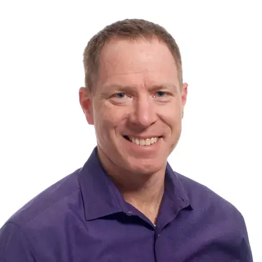

# Mastering the Agentic Coding Workflow

## Mark Michaelis, Benjamin Michaelis

### Boise Code Camp 2026 - May 2nd, 2026

Agentic Coding (formerly vibe coding) is transforming software development by shifting developers from typing every line to expressing intent and refining output. In this session, you'll learn practical techniques for AI-augmented development: structuring effective prompts, maintaining context across conversations, guiding AI reasoning, collaborating with AI during debugging, and validating generated code. This session shows how to apply Vibe Coding effectively in everyday development and then follow best practices to move it from prototype to production. You will leave knowing how to leverage AI as a reliable accelerator for shipping code with production-level quality.

---

## Speaker: Mark Michaelis

Chief Technical Architect, Founder, Author of Essential C# series, Microsoft Regional Director and MVP

Mark Michaelis (itl.tc/Mark) founded IntelliTect, a high-end software development company based in Spokane, Washington. When not leading his company, he teaches at Eastern Washington University, presents conference sessions on technology and leadership, or delivers updates for the next edition of his book.

A world-class C# expert who honed his engineering skills by serving on several Microsoft software design review teams, including C#, Azure, and Azure DevOps, Mark is the author of Essential C# (itl.tc/EssentialCSharp). As a direct result of his work with C# and Azure DevOps, Mark has been a distinguished Microsoft MVP for over 25 years and a Microsoft Regional Director since 2007. A firm believer in autonomy, mastery and purpose, Mark’s management and leadership style enables him to successfully handle a day with only 24 hours in it.

Mark and his wife, Elisabeth, have invested a significant amount of the profit generated by IntelliTect into fighting debilitating poverty around the world. They have done this by thoughtfully partnering with charity organizations to increase access to basic food and water infrastructure, improve educational opportunities, and fight injustices like human trafficking and the systematic oppression of women.

When not bonding with his computer, Mark enjoys Frisbee, soccer, biking, and showing his kids real life in other countries. Mark lives in Spokane, Washington. He is looking forward to finding his next adventure following his return from traversing the length of Africa.

[LinkedIn](https://www.linkedin.com/in/markmichaelis/) | [Blog](https://intellitect.com/Mark)

## Speaker: Benjamin Michaelis

Benjamin Michaelis is a software engineer at IntelliTect, where he builds cloud-native systems, developer tools, and full-stack .NET applications that help teams ship faster. He has contributed to IntelliTect’s product offerings, including StormingCastle.com and delivered solutions across higher education, utilities, financial services, and startups.

Benjamin is the primary maintainer of EssentialCSharp.com and co-author of Essential C#. In that role, he drives the site’s roadmap, tooling, and developer experience, including recent work adding AI-powered, context-aware documentation search. An active open-source contributor, he publishes NuGet packages, GitHub Actions, and developer utilities used by teams across the industry.

Beyond his professional work, Benjamin helps lead the Spokane .NET User Group, fostering a vibrant local developer community through technical talks, knowledge sharing, and mentorship. He also teaches .NET programming at Eastern Washington University and mentors developers through IntelliTect.

He holds a B.S. in Software Engineering from Washington State University along with multiple Microsoft and GitHub certifications, including Azure Solutions Architect Expert.

When he’s not coding, he’s probably outdoors on a trail, exploring new places with a camera in hand, or spending time with friends and family.

[LinkedIn](https://www.linkedin.com/in/benjamin-michaelis/) | [Blog](https://benjamin.michaelis.net/blog)
