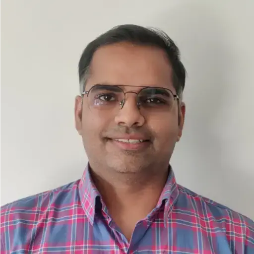

# From Cloud Native to Multi-Cloud Native: Write Once, Deploy Anywhere

## Sandeep Pal

### Boise Code Camp 2026 - May 2nd, 2026

While "Cloud Native" promised portability, that promise often stops at the boundary of a single infrastructure. The traditional definition of Cloud Native rarely addresses the reality of multi-cloud environments, leaving enterprises with deep vendor coupling through fragmented SDKs, distinct authentication flows, and proprietary APIs. It is time to evolve to Multi-Cloud Native, a development paradigm where applications are designed from day one to be agnostic to the underlying provider.
In this session, I will explore the architectural principles required to build truly portable applications using driver-based design patterns. I will demonstrate how these patterns are implemented in the ecosystem today, focusing on MultiCloudJ (Salesforce’s open-source Java SDK) and Go Cloud (Google’s open-source Go library). These libraries provide consistent programming models that decouple business logic from cloud providers, enabling a true "write once, deploy anywhere" capability.
Drawing from Salesforce’s real-world journey operating hyper-scale services across AWS, GCP, and Alibaba Cloud, I will share the engineering challenges that necessitated this shift. Finally, we will examine the role of AI in this transition: specifically, how the Model Context Protocol (MCP) can analyze SDK usage patterns to automate the refactoring of legacy, vendor-specific code into modern, multi-cloud native standards.

---

## Speaker: Sandeep Pal

Sandeep is an engineering leader with 11+ years of experience in distributed systems, storage engines, infrastructure security and cloud-native platforms. Currently Principal Engineer at Salesforce, driving multi-cloud standards and strategy across AWS, GCP, and Alibaba Cloud.
Previously, I worked on planet-scale HBase deployments at Salesforce and delivered Spark optimizations at Snapchat that saved tens of millions in infrastructure costs.

I am the founding member of MultiCloudJ, Salesforce’s open-source Java SDK for multi-cloud development, and a contributor to Apache HBase, Apache Phoenix, Apache Spark, and GoCloud.dev. Passionate about building resilient, cloud-agnostic, and data-driven systems that create real-world impact.

[LinkedIn](https://www.linkedin.com/in/pal-sandeep/) | [Blog](http://sandeepvinayak.github.io/)
