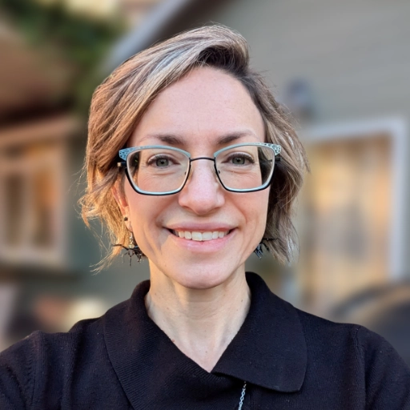

# Thinking like a SDET -- Testing Software in the Era of AI Development

## Jeanne Allen

### Boise Code Camp 2026 - May 2nd, 2026

I'll talk about what QA/SDET work looks like now that AI is doing more development than ever including tools for testing non-deterministic systems/features like AI chatbots and MCP servers. 

I'll discuss automated testing and regression and what it means to think about code from the perspective of an SDET.

QA is more important that ever these days and a lot of companies are recognizing that and staffing more SDETs

---

## Speaker: Jeanne Allen

Jeanne had a career in technical writing and digital marketing when she decided to change direction and learn to code. She graduated from CodeWorks in February 2023 and has worked at SigmaSense as a tools developer and tester for the last year and a half, a job she loves. She has a passion for learning and teaching.

[LinkedIn](https://www.linkedin.com/in/jeanne-fischer-allen/)
