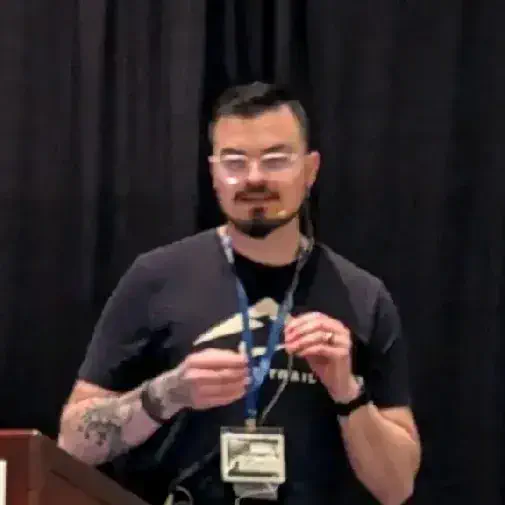

# pgFirstAid

## Justin Frye

### Boise Code Camp 2026 - May 2nd, 2026

Have you ever been asked to take a look at database in your company and just "improve performance" without any context? Or maybe walk into an "all hands" meeting to resolve a critical production issue with everyone pointing fingers at your database? I am sure we all have and use our go to tools to work our magic.

One of my favorite tools is Brent Ozar's FirstRespondersKit. It gave you a detailed and quick snapshot of what was going on with your database and prioritized the things that were "fine" and the things that were "oh god please tell me this was done on accident."

After close to a decade of being a DBA/System Admin, I wanted to build that same type of health check for PostgreSQL and make sure it was something the community could contribute to. So, I would like to show off pgFirstAid! Being a fairly new project, I would love for feedback and input on things we could do better or add to the health checks! So join me as I do a few quick demos and open the floor for comments, questions, and suggestions!

---

## Speaker: Justin Frye

I’m the founder of Randoneering, LLC and a senior engineer with over a decade of experience designing, building, and operating multi-cloud infrastructure and production systems. My work is centered on platform engineering, infrastructure architecture, automation, and Infrastructure as Code, with a focus on creating resilient, scalable foundations that support reliable delivery and long-term operational health.

Across my career, I’ve worked at the intersection of cloud infrastructure, systems design, database platforms, and service reliability. I’m especially interested in architecting environments that are easier to provision, standardize, observe, and maintain over time. From core platform design to operational automation, I enjoy building systems that reduce complexity, improve consistency, and help teams move faster with confidence. I’m also actively exploring AI-assisted engineering workflows and tooling that strengthen productivity and operational effectiveness.

In my current role as Senior Data Engineer at RxBenefits, I help build and maintain the company’s enterprise data warehouse and the platform capabilities that support reporting and analytics across the business. My responsibilities include developing and supporting ELT pipelines, managing system integrations, and improving the reliability and operational maturity of critical data services.

My technical background includes multi-cloud infrastructure, Infrastructure as Code, Python, Snowflake, ETL/ELT tooling, multi-platform database administration, systems architecture, infrastructure automation, open source tooling, and emerging AI workflows. Outside of work, I spend time with my wife and kids, get outdoors whenever I can, and keep refining my Nix craft through hands-on experimentation in personal lab environments.

[LinkedIn](https://www.linkedin.com/in/justin-frye-b4b14763/) | [Blog](https://randoneering.tech)
